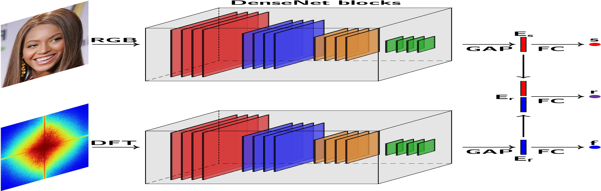

# Multi-Channel-Cross-Modal-Detection-of-Synthetic-Face-Images

## Introduction
This repository contains an official re-implementation of the approach described in the paper "Multi-Channel Cross Modal Detection of Synthetic Face Images" in PyTorch.

The paper proposes a multi-channel architecture for detecting synthetic face images. A RGB face image and its corresponding frequency spectrum is fed into separate network channels based on DenseNet. Global Average Pooling (GAP) is applied to the output of each channel to obtain embeddings which are concatenated into a joint representation. For each embedding a fully connected layer (FC) is added together with the Sigmoid function which results in three network heads. We propose to supervise the network using Cross Modal Focal Loss (CMFL).


<p align="center">
  
</p>

Please refer to the paper for additional information on the model, experiments, results, etc.

## Installation
To use this repository you will need:

* PyTorch
* Numpy  
* Scipy
* Torchvision
* Pillow

Ideally, you should make sure that torch is installed with gpu support. For this follow the official installation guide. 
The repository was tested using Python 3.8.16 and the versions specified in the requirements.txt file. 

The implementation was run using Linux and NVIDIA A100 Tensor Core GPUs. 

To create an environment named cross_modal_detection_synthetic_faces from the requirements.txt file:

```
conda create -n cross_modal_detection_synthetic_faces python=3.8
conda activate cross_modal_detection_synthetic_faces
pip install -r requirements.txt
```

The environment should now contain the neccesary dependencies. You should also be able to use newer versions of the libraries but this has not been tested

## Preprocessing data
In the original paper all images were preprocessed by performing face detection and then subsequently aligning and cropping the face to 224x224 pixels. To this end, MTCNN by K. Zhang et al. was used.
It should be possible to also run the code on face images which has not been aligned to 224x224 pixels by not setting the flag --is_aligned. However, for detecting synthetic face images it is recommended to crop to the face area as to not focus learning to artefacts that might occur in the background.

## Protocols
The protocols folder contains the different train, test and dev splits used when training on a specific known generative models, i.e. StyleGAN2, StyleGAN3 or SWAGAN. To generate the synthetic images, please refer to the original works.

## Train a model
The training code is found in the file **train.py**. To see the options for running the code run the command:

```
python train.py --help
```

## Test a model
The training code is found in the file **test.py**. To see the options for running the code run the command:

```
python test.py --help
```

## (A) Acknowledgments

This repository borrows partially from the [Cross Modal Focal Loss for RGBD Face Anti-Spoofing](https://github.com/anjith2006/bob.paper.cross_modal_focal_loss_cvpr2021), and the [Detecting CNN-Generated Images](https://github.com/PeterWang512/CNNDetection) repositories as well as the [Bob](https://www.idiap.ch/software/bob/) signal-processing and machine learning toolbox.

## (B) Citation

If you find this useful for your research, please consider citing the paper: 

**Multi-Channel Cross Modal Detection of Synthetic Face Images**:

```
TBA
```


Additionally, consider citing the following works:

**Cross Modal Focal Loss for RGBD Face Anti-Spoofing**:

```
@inproceedings{georgecvpr2021,
    author = {Anjith George and Sebastien Marcel},
    title = {Cross Modal Focal Loss for RGBD Face Anti-Spoofing},
    year = {2021},
    booktitle = {IEEE/CVF Conference on Computer Vision and Pattern Recognition (CVPR)},
}
```

**Bob**:

```
@inproceedings{bob2017,
  author = {A. Anjos AND M. G\"unther AND T. de Freitas Pereira AND
            P. Korshunov AND A. Mohammadi AND S. Marcel},
  title = {Continuously Reproducing Toolchains in Pattern Recognition and
           Machine Learning Experiments},
  year = {2017},
  month = aug,
  booktitle = {International Conference on Machine Learning (ICML)},
  url = {http://publications.idiap.ch/downloads/papers/2017/Anjos_ICML2017-2_2017.pdf}
}

@inproceedings{bob2012,
  author = {A. Anjos AND L. El Shafey AND R. Wallace AND
            M. G\"unther AND C. McCool AND S. Marcel},
  title = {Bob: a free signal processing and machine learning toolbox for researchers},
  year = {2012},
  month = oct,
  booktitle = {20th ACM Conference on Multimedia Systems (ACMMM), Nara, Japan},
  url = {https://publications.idiap.ch/downloads/papers/2012/Anjos_Bob_ACMMM12.pdf},
}
```

**CNN-generated images are surprisingly easy to spot...for now**:

```
@inproceedings{georgecvpr2021,
    author = {Anjith George and Sebastien Marcel},
    title = {Cross Modal Focal Loss for RGBD Face Anti-Spoofing},
    year = {2021},
    booktitle = {IEEE/CVF Conference on Computer Vision and Pattern Recognition (CVPR)},
}
```